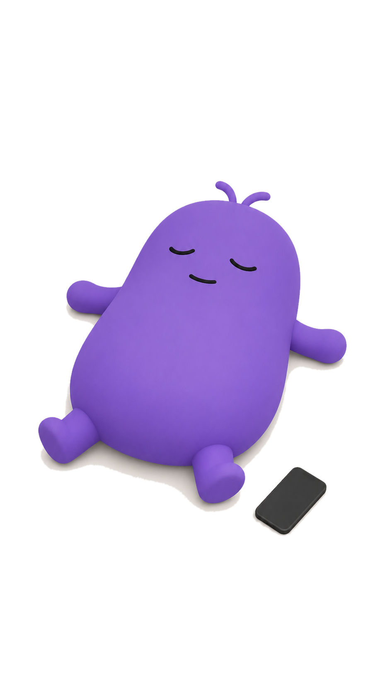

# Rotto

**A screen-time score with a face.** Rotto starts your day at 100 and drains
as you spend time in the apps you choose to track — and his mood follows
along. Higher is better; he never blocks or closes anything, he just reacts.

<p align="center">
  
  
  
  
  
</p>
<p align="center"><em>Energetic → Scrolling → Tired → Binge Mode → No Energy</em></p>

## What it does

Rotto reads Android's `UsageStatsManager` for the apps you pick, adds up
today's foreground time, and turns that into a 0–100 score plus one of five
moods. That's the whole idea — no accounts, no backend, no ads, nothing
leaves the phone.

- **The Rotto score** — 100 down to 0, draining as tracked time climbs
- **Five moods** — Energetic, Scrolling, Tired, Binge Mode, No Energy, each
  with its own pose
- **Track any app** — not a fixed list; anything installed can be added
- **Per-app detail** — tap an app for its own 7-day history and session habits
- **Insights** — today / week / month views: a coin chart, a calendar, totals
  and trends against the period before
- **Home screen widget** — the score and Rotto's mood, one glance away
- **Daily report + mood-change notifications** — optional, local-only
- **100% offline** — real foreground time, nothing estimated or inferred

## Score bands

| Score | Mood | Screen time from |
|---|---|---|
| 100–80 | Energetic | 0m |
| 79–60 | Scrolling | 50m |
| 59–40 | Tired | 1h 38m |
| 39–20 | Binge Mode | 2h 26m |
| 19–0 | No Energy | 3h 14m |

The score reaches 0 at 4 hours. That single number
(`drainedAtMinutes` in [`lib/utils/rotto_score.dart`](lib/utils/rotto_score.dart))
fixes every band above — the minute figures are derived from it, not
hand-tuned per row, and [`test/rotto_score_test.dart`](test/rotto_score_test.dart)
pins them so a change to the knob can't drift the app's own copy quietly out
of sync with what it tells the user.

## Getting started

```bash
flutter pub get                          # install dependencies
flutter run                              # run on a connected device/emulator
flutter analyze                          # lint
dart format lib/ test/                   # format
flutter test                             # run the test suite
flutter build appbundle --release        # release bundle for Play Store
```

Needs a device or emulator with Google Play services for `usage_stats` and
`device_apps` to work — Usage Access has to be granted from the system
settings the app links to on first run.

## Project layout

```
lib/
  screens/     onboarding, home (owns the 3-tab shell), insights, app
               detail, settings, tracked-apps picker
  widgets/     shared UI (ui_kit.dart), the coin chart + month calendar,
               the day-detail popup, tracked-app tiles
  services/    Hive storage, Android usage-stats reading, notifications
  models/      Hive-typed daily stats + plain per-app usage stats
  utils/       the Rotto score model, mood presentation, format helpers
android/       native widget provider, live-bubble overlay service
```

See [`CLAUDE.md`](CLAUDE.md) for the full architecture — the usage-reading
approach and why it matters, the Hive schema and its migration history, the
widget/notification native side, and the design system. See
[`AGENTS.md`](AGENTS.md) for contribution conventions.

## Built with

Flutter · [`hive`](https://pub.dev/packages/hive) (local storage) ·
[`usage_stats`](https://pub.dev/packages/usage_stats) (Android screen time) ·
[`device_apps`](https://pub.dev/packages/device_apps) (installed-app list +
icons) · [`flutter_local_notifications`](https://pub.dev/packages/flutter_local_notifications) ·
[`home_widget`](https://pub.dev/packages/home_widget) ·
[`flutter_animate`](https://pub.dev/packages/flutter_animate)

## Privacy

Everything runs on-device. No account, no analytics, no ads, no server —
see [`PRIVACY_POLICY.md`](PRIVACY_POLICY.md) for the full policy.

## Play Store listing

Draft copy, screenshots and upload assets for the store listing live in
[`store/`](store/play_listing.md).
